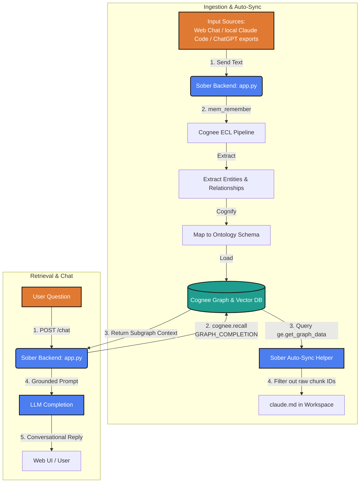

# 🍸 Sober — Curing the AI Hangover with Persistent Memory

> **"Every AI tool you use has amnesia. You close the tab or switch tools, and they wake up with a context hangover — asking, where is my memory? Sober is the persistent memory layer that cures the AI amnesia."**

Sober is a self-hosted, open-source AI memory companion built for the **WeMakeDevs × Cognee Hackathon**. It uses **Cognee's hybrid graph-vector memory engine** to build a single, unified memory graph that spans across **every AI tool you use** (ChatGPT, Claude Web, Claude Code CLI, Gemini, Cursor).

---

## 🚀 Key Features

*   **🧠 Cures AI Amnesia (`remember` & `recall`)** — Conversation history is not stuffed raw into the prompt context window. Instead, Cognee extracts structured entities and relationships, storing them permanently in a local graph database.
*   **🔄 Automated Cross-Tool Context Sync (`claude.md`)** — Sober automatically compiles your graph nodes and writes a cleaned, high-value memory file (`claude.md`) directly in your workspace. Your IDE tools (like Claude Code or Cursor) instantly read it to absorb your latest context without manual copy-pasting.
*   **📊 Live Obsidian-Style Visual Graph** — Scroll down to watch your memory form in real-time on an interactive, force-directed graph canvas with subtle connection lines and nodes.
*   **⚡ High Performance Ingestion** — Uses asynchronous background threads (`run_in_background=True`) to ingest massive chat history files (e.g. 20,000+ characters) instantly without freezing the UI.
*   **🛡️ Input Sanitization** — Automatically filters out minified code bundles, base64 images, and system tokens (over 1000 characters) to prevent database chunking errors.
*   **✨ Self-Improving Memory (`improve`)** — Every 5 chat turns (and on-demand via the Improve button), Sober runs Cognee's enrichment pipeline to deepen the graph and re-weight memory — it gets sharper the more you use it.
*   **📉 Flat Token Cost & ~97% Savings** — Only retrieves the relevant memory slice using hybrid search, keeping token usage flat (~86 tokens) even after 100+ turns (see `benchmark.py`).

---

## 🛠️ Architecture Flow



---

## 🛠️ Quick Start

### 1. Installation
Ensure you have Python 3.10+ installed. In your terminal:
```bash
# Clone the repository and navigate inside
cd sober

# Create a virtual environment and activate it
python -m venv .venv
source .venv/bin/activate

# Install dependencies
pip install -r requirements.txt
```

### 2. Configure Environment variables
Copy the `.env.example` file to `.env` and fill in your keys:
```bash
cp .env.example .env
```
Make sure to add your Groq/OpenAI keys. We recommend the fast, reasoning model `openai/gpt-oss-120b` (or `openai/gpt-4o-mini`) on Groq.

### 3. Launch Server
```bash
uvicorn app:app --port 8000 --reload
```
Open **`http://localhost:8000`** in your browser. 
* Sign in with your email.
* Upload your history or connect your local Claude Code transcripts.
* Chat with Sober and watch the graph render dynamically!

---

## 📊 Benchmarking Performance

To prove how much token space and API cost Cognee memory saves compared to naive context-stuffing:
```bash
python benchmark.py
```

### Naive Prompt vs. Cognee Memory Graph (Real run, 100 turns)
*   **Naive Prompt Tokens**: **~2,812** — grows linearly with every turn, and eventually overflows the context window entirely.
*   **Cognee Recall Tokens**: **~86** — stays flat regardless of how long the chat history becomes, because hybrid graph-vector search retrieves only the relevant slice.
*   **Token Savings**: **~97%** reduction in prompt size at 100 turns — and the gap keeps widening as history grows.
*   **Recall Accuracy**: with the fact buried under 97 turns of small talk, Cognee still answered *"Your dog's name is Pixel, and he's a beagle."*

---

## 🧩 How Cognee Powers Sober

We utilize Cognee's core memory lifecycle APIs directly to power the user experience:

| Feature in Sober | Under the Hood Cognee API |
| :--- | :--- |
| **Ingesting chat / transcripts** | `cognee.remember(text, dataset_name)` |
| **Grounded Retrieval Query** | `cognee.recall(query, SearchType.GRAPH_COMPLETION)` |
| **Custom Visualizer & Context Sync** | `get_graph_engine().get_graph_data()` |
| **Self-Improving Memory** | `cognee.improve(dataset)` — auto-runs every 5 chats + on-demand via the ✨ Improve button, enriching the graph and re-weighting memory from usage |
| **Forget Memory / Reset** | `cognee.forget(everything=True)` |

---

## 🏅 Hackathon Tracks Targeted
*   **Track 1: Best Use of Open Source** — Running entirely on self-hosted Cognee open-source graph-vector databases (Kuzu / Ladybug).
*   **Track 2: Best Use of Cognee Cloud** — Supports seamless toggle to Cognee Cloud simply by setting `COGNEE_CLOUD_URL` and `COGNEE_CLOUD_API_KEY` in your `.env`.
*   **Track 4 & 5: Best Blogs & Social Buzz** — Narrated walkthroughs and blog scripts inside [BLOG.md](file:///Users/yashigupta/Downloads/sober/BLOG.md) and [DEMO_SCRIPT.md](file:///Users/yashigupta/Downloads/sober/DEMO_SCRIPT.md).
